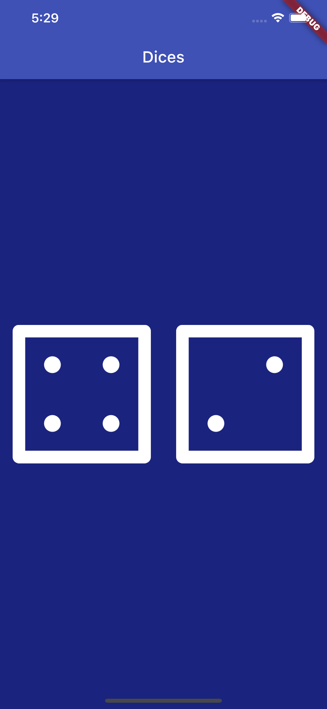

# Dices 🎲

A simple Flutter App for rolling dices. The learning objective of this exercise on the way to learning Flutter was to add functionality to a simple App by using setState() inside Stateful Flutter widgets.

## Learning objectives:

- Using Flutter stateless widgets to design the UI
- Using Flutter stateful widgets to update the UI
- Changing the properties of various widgets
- Using onPressed listeners to detect when buttons are pressed
- Using setState to mark the widget tree as dirty and requiring update on the next render
- Using Expanded to make widgets adapt to screen dimensions
- Using string interpolation
- Basic dart programming concepts such as data types and functions
- Coding and using gesture controls
